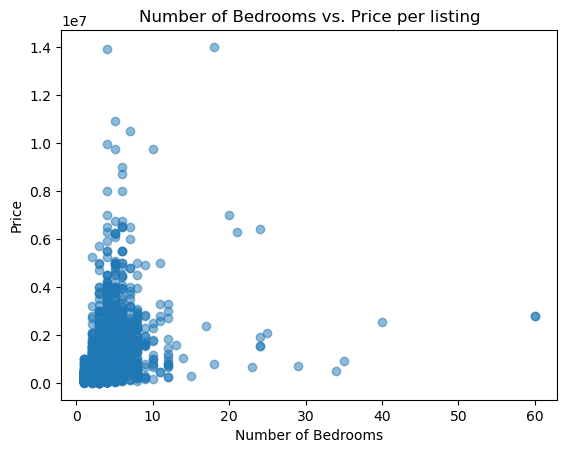
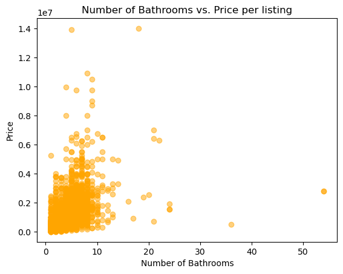
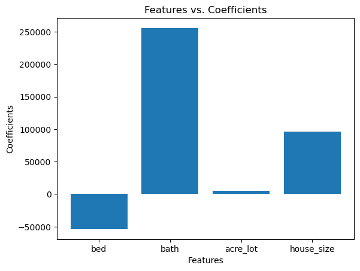

# Project 2

## Problem Definition
As someone who has recently entered adulthood, one of the most crucial components of living on your own is WHERE you are going to live. Not only is the 'where' aspect of a home most important, but another humongous factor of choosing a place to live is price. In this project, I will be predicting the price of various house listings in North Carolina from a dataset via the website Kaggle and was collected "via web scraping using python libraries" (Shahriar Sakib 2023). The target variable of this project is of course 'price' and since this is a numerical feature, it is classified as a regression problem. Someone who may benefit from this model or its predictions may be someone who is in the process of looking for a home, or a new realtor who wants to see which factors impact the price of a home listing. This prediction problem is worth investigating, as if you were someone in the process of looking for a home and the location (for example) is a large factor in price, then that person may want to look for a home in a smaller/less populated location in order to find a cheaper home. 

## Background and Context
In order to understand this problem in general, not much is needed to know besides the fact that different aspects of a home (number of bathrooms/bedrooms, location, etc.) impact the price. As for the code aspect of this project, you will need to understand scikit-learn libraries in Python. (Incomplete)

## Data Description
As previously stated, the data came from a website called Kaggle and was uploaded by Ahmed Shahriar Sakib. An exact date of publication was not listed, but the website did state that the dataset was last updated 3 years ago. The original dataset that I obtained from the website contained 2,226,382 entries and 10 different columns (Shakhriar Sakib 2023). Each row represents a single listing on Realtor.com with available features such as brokered_by, status, price, bed, bath, acre_lot, street, city, state, zip_code, house_size, and prev_sold_date. Since the data was already prepared in a csv file, I did not have any limitations or restrictions with the data itself.

## Data Understanding, Exploration, Preparation, and Feature Selection
Due to the size of the original dataset (and it exceeding the maximum row count that my computer can read), I decided to trim down the amount of rows that I planned on using in the models. The original dataset contained listings from various cities in every state and since I live in North Carolina, I decided to use listings exclusively from my state (making the row count 85,745). After creating a new file with exclusively North Carolina listings, I was sifting through the file to make sure that I obtained the correct information when I noticed that some of the observations did not include values for variables such as bed, bath, and house_size. This is when it occurred to me that the listings within this dataset not only included residential buildings, but empty lots of land as well. Since my problem is based around the prediction of actual building prices, I made the decision to again trim the dataset and remove rows that had missing values for bed, bath, and house_size variables (making the final row count 37,342). When looking at the summary statistics of the housing listings for my final dataset, I noticed that the average listing had 3 bedrooms and 2 bathrooms, and the average house was 2,058 square feet. In order to further gauge the relationships between the target variable (price) and the other features, I decided to create two different scatterplots comparing the number of bedrooms vs. price, and number of bathrooms vs. price (per listing). The reason that I chose the bed and bath variables for my visualizations is because one of the very first aspects of a house that you see listed under the price is the number of bedrooms and number of bathrooms. Since these two variables are always prominently displayed with the price in listings, I thought that it would be most relevant to use them as visualizations. 

(0.2 meaning 2,000,000)

When looking at the scatterplot above for the number of bedrooms vs. the price per listing, there are obviously a few outliers. Namely, the one listing with 60 bedrooms. This intrigues me, as what kind of residential building for sale has 60 bedrooms? Along with this finding, I noticed that most of the listings on the scatterplot have under 10 bedrooms and are under $2,000,000.

(0.2 meaning 2,000,000)

When looking at the scatterplot above for the number of bathrooms vs. the price per listing, most of the listings have under 10 bathrooms. One listing (in similar fashion to the plot above) has over 50 bathrooms and is just under $4,000,000. 

After looking at the scatterplots above and a few of the outliers, I realized that there must be multiple factors that affect the price of the listing, as a house with 60 bedrooms for only $4,000,000 seems impossible.The features that I decided to choose for my models were bed, bath, price, acre_lot, and house_size, as since they are numerical they would be the best choice for my prediction problem. I separated my data for testing and training by using the 'train_test_split' function from the 'sklearn.model_selection' library, and prevented data leakage by using the 'StandardScaler' function in 'sklearn.preprocessing'. 

## Baseline and Model Development
The baseline model that I chose was the linear regression model, as my problem is focused around prediction. As for the machine-learning models, I chose to train Lasso and Ridge models because they are a good alternative if the original model has strong multicollinearity. I did not tune any of the model's settings or hyperparameters, and I ensured that the models were compared fairly by initializing and executing the models in the exact same way, as well as extracted the same metrics.

## Model Evaluation and Selection
The evaluation metrics that I decided to choose for my models were R^2 and Root Mean Squared Error. I chose these metrics so that I would be able to see the proportion of variance explained by each model, and the amount of dollars that the model is off by on average. Compared to the baseline model, the machine learning models performed only slightly worse than the baseline model. The baseline model (Linear Regression model) had an R^2 value of 0.4564 and a Root Mean Squared Error (RMSE) value of 315,762.85 (in dollars). The Ridge model had an R^2 value of 0.4198 and an RMSE value of 326,187.30. The Lasso model had an R^2 value of 0.4508 and an RMSE value of 317,345.89. After evaluating the metrics of the models, the original baseline model has a higher R^2, making it my final model. 

## Model Interpretation and Insights
After creating a bar chart to display the features vs. their coefficients in the Linear Regression model (baseline), the chart showcased that the 'bath' and 'house_size' features have the largest impact on price with coefficients of 255,663.55 and 95,764.56 (respectively). The coefficient values display the price change per single unit of change by feature. 

One major outlier in the chart that I'd like to point out is the negative coefficient value for the 'bed' feature. This coefficient value came out to be -53,786.09, which is interesting considering the fact that the coefficient for 'bath' is so high (typically the number of bathrooms in a house is dependent on the number of bedrooms). Since the number of bathrooms can be predicted by the number of bedrooms in a house, this would suggest multicollinearity within the model, which explains why the coefficients for the 'bed' and 'bath' variables are the way they are. Now, this does not necessarily mean that the number of bedrooms decreases the price of the house, it simply just means that the number of bathrooms is a better estimator for the price of a home. This may be due to factors such as the plumbing and electricity required to make the bathrooms functional, which makes sense as those functions are more costly than building another empty room. 

## Limitations, Ethics, and Reflection

## Code and Transparency

