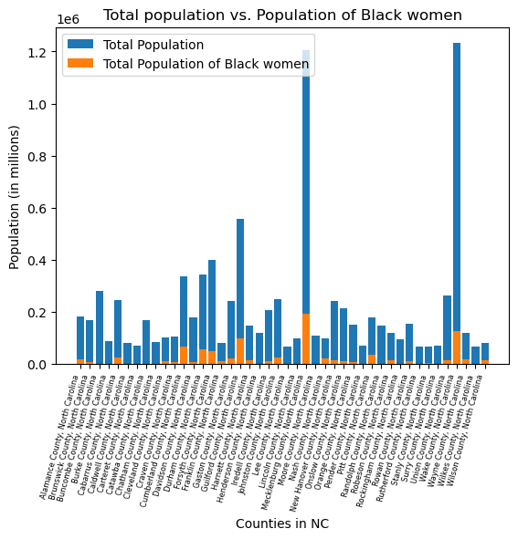
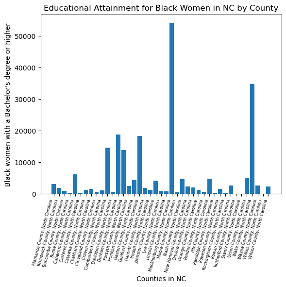
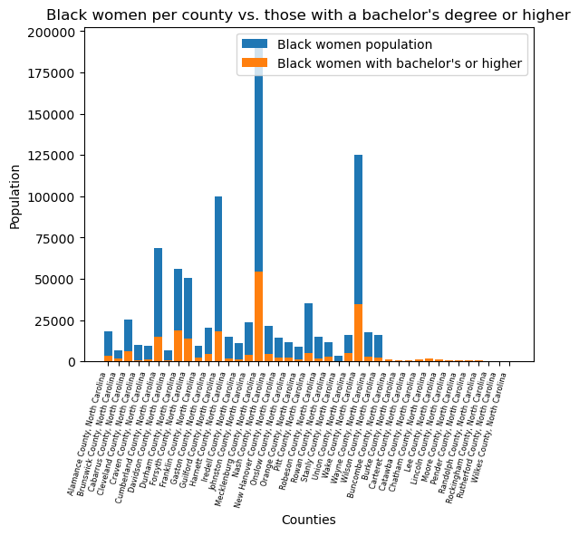

# Do counties in North Carolina with large populations have a higher percentage of Black women in higher education?

## Problem Definition
The problem that I chose to explore was "Do counties in North Carolina with larger populations have a higher percentage of Black women in higher education?". The reason I chose this topic, is because as a Black woman who is pursuing a bachelor's degree, I am aware that there aren't as many Black women that I expected who are pursuing or have higher education degrees. One of my goals in life is to serve as an example for younger Black girls, so that they can grow up and aspire to pursue higher education as well.

## Data Description
The key variables in this project include: Name of the county, total population by county, total population of Black women by county, and total population of Black women with a bachelor's degree or higher by county. The data was collected from the American Community Survey (ACS) by the US Census Bureau. The most recent data available via an API was from 2024. Each row represents data from a county in North Carolina that the Bureau collected. The main features of the data display the variables in each column. During the data collection, I realized that the dataset was not as large as I expected it to be. I assumed that all 100 counties in North Carolina would be in the dataset, but that turned out to not be the case. After doing a bit of research on the Census Bureau's website, I discovered that the American Community Survey (ACS) "only releases 1-year data for population groups sized 65,000 or more" (Rosenthal 2020). 

## Data Cleaning and Preparation
While scanning my datasets, I noticed that some rows contained null/empty values. The method that I used for cleaning up this data was using the .dropna() function, and dropping the rows with missing values. My justification for dropping the rows was because they didn't appear on my visualizations, therefore they did not provide any actual value to my research question.

## Visualizations, Insights, and Narrative

The first visualization that I decided to create, was a bar chart of the total population in each county in North Carolina (from the cleaned data) versus the total population of Black women there. As observed in the chart, all county's in our state have a small population of Black women compared to the total. In the most populated county recorded in 2024, Wake county had a total of just over 1.2 million people, with their population of Black women being only 125,000. Thus meaning that even the most heavily populated county in North Carolina was made up of 10.16% Black women. In contrast, there were many counties who had null values of Black women that I decided to include. It may seem silly to include a visualization of these counties with no recorded population of Black women, but it was for a reason. These counties (Buncombe, Burke, Caldwell, etc.) most likely had null values due to there being a significantly low population of Black women, resulting in them not being counted. Despite how small that number may truly be, I believe that they deserve to be counted.

The final visualizations that I decided to create were bar charts of the educational attainment for Black women by county alone, and then a comparison of that to the total population of Black women per county. I wanted to create two separate visualizations in order to display how having a chart with only one variable could possibly be deceiving , and make the numbers seem larger than they truly are. Looking at the chart for "Educational Attainment for Black Women in NC by County", there are a few very clean outliers, with Mecklenburg and Wake county being the largest values, and Rutherford, Stanly, and Wilkes county being the smallest values. Despite there being recorded values for Black women with higher education degrees, there are no values recorded for the total population of Black women in Wilkes and Rutherford county. The reason for these missing values in the population data but not in the educational attainment data may be due to a small oversight on the Census Bureau's part, so for comparison I will be using the county with the smallest recorded data that appears on both charts. When looking at the second chart, it is clear that the population of Black women with higher education degrees is significantly lower than the population of Black women in each county. For Mecklenburg county, only 54,099 out of the 192,921 Black women have degrees in higher education (28.04%). In Wake county, only 34,745 out of the 125,166 Black women have degrees in higher education (27.76%). Now let's see how it compares to lower populated counties such as Stanly and Davidson county. In Stanly county, only 79 out of the 3260 Black women have degrees in higher education (2.42%). In Davidson county, only 639 out of the 6511 Black women have degrees in higher education (9.81%).

## Limitations, Ethics, and Reflection
From the calculations that were made, there is a clear gap in the educational attainment of degrees for Black women in each county, with higher populated counties having a higher percentage. The reasoning for there being such low percentages may be due to the low percentage of Black women in each county. If there were more Black women with higher education degrees per county, then it could result in motivation for young Black girls to also pursue degrees.

The details of this dataset fail to capture the demographics of every single county in North Carolina, which of course leads to a collection gap. If there were a way for me to do so, I would explore the demographics (variables I selected) across every single county in North Carolina. I believe that it is unfair to represent only a percentage of counties per state depending on their population size, and that everyone (no matter how small their numbers may be) deserves to be represented in the US Census Bureau.

## Code

## Citations
Author(s, & Rosenthal, J. (2020, January 2). 4 Easy pieces regarding census data. Nc.Gov. https://www.commerce.nc.gov/blog/2020/01/02/4-easy-pieces-regarding-census-data
Bureau, U. C. (2020, September 17). American Community survey 1-Year data (2005-2024). The United States Census Bureau. https://www.census.gov/data/developers/data-sets/acs-1year.html
US Census Bureau. (2025, September 11). Variables. ACS 2024 Variables. https://api.census.gov/data/2024/acs/acs1/variables.html
<ins> Variables Used: </ins> C15002B_011E (Black women per county with a degree), B01001B_017E (Total population of Black women per county), and B01001_001E (Total population per county).

